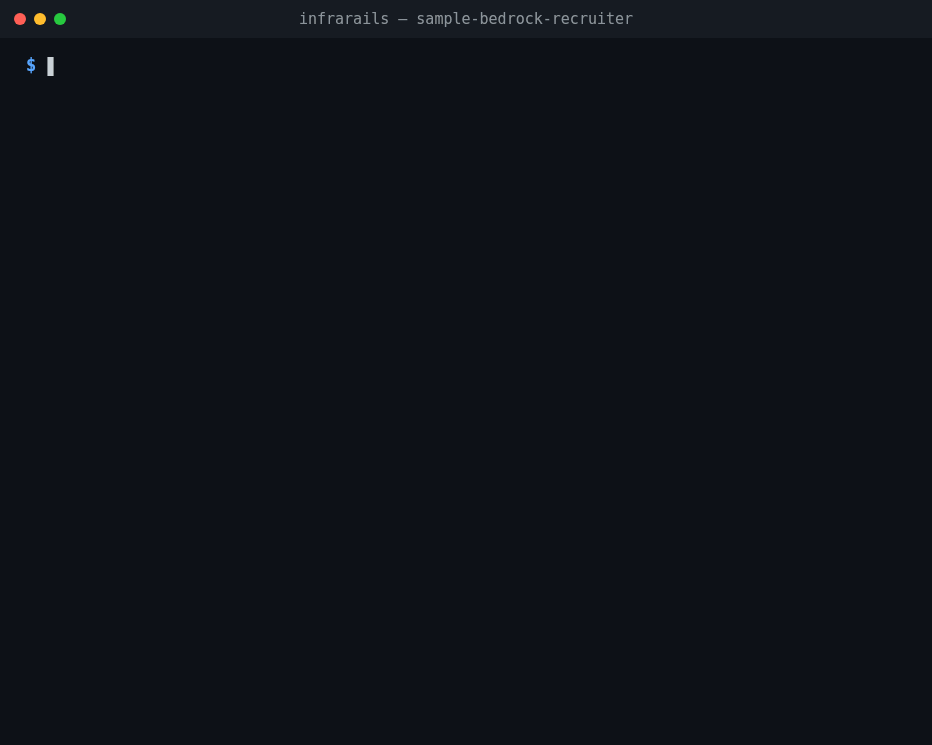
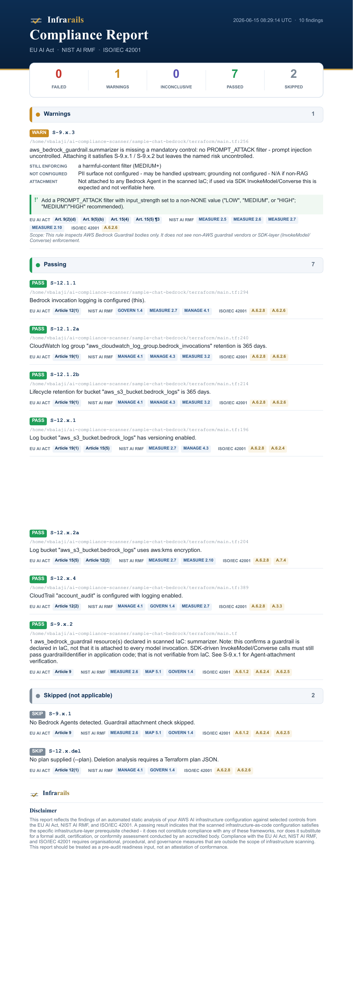
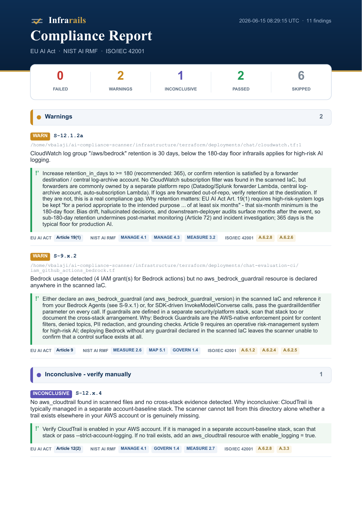

# infrarails

**Catch EU AI Act, NIST AI RMF, and ISO 42001 gaps in your AWS Bedrock infrastructure - before you deploy.**

A static compliance scanner for **Terraform** and **CloudFormation**. Point it at your `.tf` files or CFN templates - no deploy, no AWS credentials - and get a clear **pass / fail / can't-verify** report on the EU AI Act Article 9 (guardrails) and Article 12 (logging, retention, traceability) controls, each cross-referenced to NIST AI RMF and ISO 42001. Output as **terminal**, **JSON**, **SARIF**, **HTML**, or **PDF**.

[](LICENSE)
[](https://www.npmjs.com/package/infrarails)
[](https://nodejs.org/)

<p align="center">
  
</p>

---

## Quick start

Install the CLI, then scan a directory. Pick the row that matches what you're scanning:

```bash
npm install -g infrarails
```

**Scanning Terraform** (`.tf` / `.tf.json`) - also needs [`hcl2json`](https://github.com/tmccombs/hcl2json) on `PATH`:

```bash
brew install hcl2json        # macOS; Linux/Windows in Prerequisites
infrarails ./infra/          # scan a Terraform directory
```

**Scanning CloudFormation** (`.yaml` / `.yml` / `.json`) - **no `hcl2json` required**:

```bash
infrarails ./templates/ --input cfn
```

That's the whole happy path - no deploy, no AWS credentials. Want a report to share? Add `--format pdf -o report.pdf` (or `--format html`). Runs natively on macOS, Linux, and Windows; full per-OS install steps are in [Prerequisites](#prerequisites).

> **Which dependencies do I need?** Node.js is always required. `hcl2json` is required **only for the Terraform path** - a CloudFormation-only scan never calls it. A mixed directory needs both.

---

## Why infrarails

- **Shift compliance left.** Find missing guardrails, logging, retention, and encryption controls in code review - not in an audit six months after deploy.
- **No deploy, no credentials.** It reads your IaC statically. Nothing is applied, nothing touches your AWS account.
- **Terraform *and* CloudFormation.** Every rule runs against both dialects. Mixed directories (a TF module next to a SAM template) scan as one estate.
- **Honest by design.** When it can't prove a control is in place, it says `INCONCLUSIVE` - never a false `PASS`. For a compliance tool, "we couldn't verify" is the only honest answer.
- **Auditor-ready output.** Each finding maps to a specific EU AI Act / NIST AI RMF / ISO 42001 control, and exports to PDF, HTML, SARIF, or JSON.

### What you get

Color-coded findings grouped by status, each cross-referenced to the control it maps to. Two real scans, rendered with `--format pdf`:

| `sample-chat-bedrock` (small, focused stack) | `infrastructure` (large multi-stack estate) |
| --- | --- |
| [](docs/samples/sample-report-bedrock.png) | [](docs/samples/sample-report-infrastructure.png) |

---

## 🔭 Coming next

`infrarails` scans AWS Bedrock IaC today. Two things are on the way:

- **SageMaker scanning** - endpoints, data-capture & model logging, and guardrail-equivalent controls, mapped to the same EU AI Act / NIST / ISO frameworks.
- **Drift attestation** - cryptographically signed, write-once evidence that the infrastructure you scanned is the infrastructure still running. Out-of-band changes are recorded with who/when attribution - **even when they're reverted before anyone looks.** Built for the person who has to hand an auditor *evidence*, not screenshots.

**Status: in private development.** Join the waitlist and we'll email you the moment each one ships:

### 👉 [Join the waitlist →](https://forms.gle/bugEVrnQnWJuVCGg7)

Prefer GitHub? Star or watch this repo, or open an issue titled `waitlist: sagemaker` or `waitlist: drift`.

---

## What is this?

`infrarails` is built for teams running **high-risk AI systems on AWS Bedrock**, and for teams voluntarily adopting Article 9 / Article 12-equivalent controls under **NIST AI RMF** or **ISO/IEC 42001**. It reads your **Terraform HCL** (and `.tf.json` from cdktf, Terragrunt, and similar generators) **and your CloudFormation templates** (YAML/JSON, including SAM and `cdk synth` output) and reports exactly which infrastructure-layer controls are passing, failing, or cannot be verified statically.

Each finding is cross-referenced against:

- **EU AI Act** (Regulation 2024/1689) - Article 9 (risk management) and Article 12 (logging and traceability)
- **NIST AI RMF 1.0** - GOVERN / MEASURE / MANAGE / MAP functions
- **ISO/IEC 42001:2023** - Annex A controls (A.6.1.x, A.6.2.x)

> **Prerequisite, not a certificate.** A fully passing run is a **necessary but not sufficient** condition for EU AI Act / NIST AI RMF / ISO 42001 conformance. `infrarails` only verifies that a narrow set of AWS Bedrock infrastructure primitives are **declared** in your IaC - it does not evaluate organisational, procedural, application-level, or runtime controls. See the [Disclaimer](#disclaimer) for the full scope statement.

---

## Supported inputs

| Input | Files | How |
|---|---|---|
| Terraform | `.tf`, `.tf.json` | Native (via `hcl2json`) |
| CloudFormation | `.yaml`, `.yml`, `.json` | Normalised into the same internal shape; every rule runs unchanged |
| Mixed directories | any of the above | Auto-detected per file - a Terraform module next to a SAM template scans as one estate |

Detection is by extension **plus content shape**: a `.json` is CloudFormation only if it declares `AWSTemplateFormatVersion`, a `Transform`, or a `Resources` map of `AWS::*` types - a `package.json` or Kubernetes manifest is skipped, never misparsed. Force one dialect in CI with `--input tf` or `--input cfn` (default `auto`). A malformed file that plausibly *is* a CFN template is a hard error (exit `2`), not a silent skip. Mixed-source terminal reports tag each finding with a `[terraform]` / `[cloudformation]` chip.

<details>
<summary><strong>CloudFormation specifics the scanner is honest about</strong></summary>

- **Intrinsics** are resolved when static (`!Ref` to a parameter with a `Default`, all-static `!Sub`/`!Join`/`!FindInMap`/`!Select`/`!Split`/`!Base64`) and reported as `INCONCLUSIVE` with a precise reason when not: `Fn::ImportValue` (`cfn-import-value`), `{{resolve:ssm:...}}` dynamic references (`cfn-dynamic-reference`), pseudo parameters (`cfn-pseudo-parameter`), `Fn::If` and friends (`cfn-fn-not-static`).
- **`Conditions` are never evaluated.** A resource guarded by `Condition:` may not exist at deploy time, so rules report it `INCONCLUSIVE` (`cfn-condition-gated`) rather than trusting its properties.
- **Bedrock invocation logging cannot be declared in CloudFormation** - there is no CFN resource type for it (AWS's own pattern uses a Lambda-backed custom resource). When all Bedrock usage comes from CFN templates and no logging config is in scope, `S-12.1.1` stays `INCONCLUSIVE` (even under `--strict-account-logging`) and the remediation points at `PutModelInvocationLoggingConfiguration` / a Terraform stack.
- **Nested stacks** (`AWS::CloudFormation::Stack`) are treated like remote Terraform modules: not fetched, flagged by `S-12.x.5` when they look Bedrock-related. `Fn::ImportValue` of a baseline-named export counts as cross-stack evidence the same way `terraform_remote_state` does.
- **`--plan` stays Terraform-only.** CloudFormation change sets are a separate, future feature.
- **CDK users:** scan the synthesized output (`cdk synth > template.yaml`), not the CDK source.

</details>

---

## Rules

`infrarails` ships **11 rules** mapped to Articles 9 and 12. Each finding is one of: **PASS**, **FAIL**, **WARN**, **SKIP**, or **INCONCLUSIVE**.

| Rule ID | Severity | Article | Check |
|---|---|---|---|
| `S-9.x.1` | FAIL | 9 | Bedrock Agents must have a versioned guardrail attached (Agent-attached only - raw `InvokeModel`/`Converse` SDK calls are application-layer and out of scope for static IaC scanning) |
| `S-9.x.2` | WARN | 9 | When Bedrock is in use, at least one `aws_bedrock_guardrail` should be declared in the scanned Terraform |
| `S-9.x.3` | WARN | 9, 15 | `aws_bedrock_guardrail` bodies must enforce both mandatory surfaces - a `PROMPT_ATTACK` prompt-injection filter and a harmful-content filter at `MEDIUM`/`HIGH`. PII (incl. `ANONYMIZE`), contextual grounding, and denied topics score as supporting context, never penalised on absence. AWS Bedrock Guardrails only |
| `S-12.1.1` | FAIL | 12 | `aws_bedrock_model_invocation_logging_configuration` is declared when Bedrock is in use |
| `S-12.1.2a` | WARN | 12 | CloudWatch log group has retention ≥ 180 days, or a forwarder is detected. Escalates to **FAIL** under `--strict-account-logging` when no subscription filter is found |
| `S-12.1.2b` | FAIL | 12 | S3 log bucket lifecycle ≥ 180 days (FAIL < 180; WARN 180-364; PASS ≥ 365) |
| `S-12.x.1` | FAIL | 12 | S3 log bucket has versioning (or object lock) enabled |
| `S-12.x.2a` | FAIL | 12 | S3 log bucket has KMS server-side encryption configured |
| `S-12.x.4` | FAIL | 12 | A CloudTrail trail is present and enabled |
| `S-12.x.5` | WARN | 12 | Flags remote modules whose contents are not statically inspectable. Auto-SKIPped when `--plan` is supplied |
| `S-12.x.del` | FAIL | 12 | **Plan-only.** Flags `resource_changes` actions that destroy logging, retention, or monitoring resources (logging config, log-destination buckets/log-groups, SSE/lifecycle configs, metric filters, alarms). Replacements (create+delete) downgrade to WARN. SKIPped without `--plan` |

<details>
<summary><strong>Why the retention rules are graduated</strong></summary>

`S-12.1.2a` is intentionally WARN-only by default - real estates often satisfy retention via a forwarder (Datadog/Splunk/SIEM, central log-archive account, auto-subscription Lambda) the scanner can't see. When an `aws_cloudwatch_log_subscription_filter` targets the log group, the WARN message says so; otherwise it reminds the reader forwarders are commonly out-of-repo. `S-12.1.2b` uses the same graduated thresholds on the S3 side: 365 = audit-grade, 180 = floor below which Article 72 (post-market monitoring) routinely breaks.

</details>

---

## How to use

```bash
infrarails <directory> [options]
```

| Flag | Default | Description |
|---|---|---|
| `-f, --format <format>` | `terminal` | `terminal`, `json`, `sarif`, `html`, or `pdf`. `pdf` is binary and **requires `-o`**. Unknown values exit `2`. |
| `-o, --output <file>` | stdout | Write report to a file. Required for `--format pdf`. When `html`/`json`/`sarif` is used without `-o` and stdout is a TTY, prints a tip to stderr (silent when piped, so scripts/CI are unaffected). |
| `--no-strict` | strict on | Treat `INCONCLUSIVE` as non-blocking. By default INCONCLUSIVE blocks the exit code like FAIL - for a compliance tool, "we couldn't verify" should not silently pass a CI gate. |
| `--strict-account-logging` | off | Asserts the scanned tree is the entire estate. Three escalations: (1) missing logging config → `FAIL`; (2) `S-12.1.2a` retention findings → `FAIL` when no subscription filter is found; (3) with `--plan`, user-fixable INCONCLUSIVEs → `FAIL` (see [Audit-grade scan with `--plan`](#audit-grade-scan-with---plan)). |
| `--plan <file>` | - | Path to Terraform plan JSON (`terraform show -json tfplan.bin`). Resolves expressions and exposes resources inside remote modules. **Plan files contain resolved variable values - treat as ephemeral.** Full workflow, caveats, and `-target` warning: see [Audit-grade scan with `--plan`](#audit-grade-scan-with---plan). |
| `--input <mode>` | `auto` | Input dialect: `auto` detects per file; `tf` scans Terraform only; `cfn` scans CloudFormation only. Use the forced modes in CI pipelines that need a hard guarantee about what was scanned. |
| `--version`, `-h` | - | Version / help |

### Exit codes

| Code | Meaning |
|---|---|
| `0` | No blocking findings |
| `1` | One or more blocking findings (FAIL, WARN; plus INCONCLUSIVE in strict mode) |
| `2` | Tool error - invalid directory, `hcl2json` not found, etc. |

### Examples

```bash
infrarails ./infra/                                   # human-readable terminal output
infrarails ./templates/ --input cfn                   # CloudFormation only (no hcl2json needed)
infrarails ./infra/ --format html  -o report.html     # collapsible HTML report
infrarails ./infra/ --format pdf   -o report.pdf      # paginated PDF (best for sharing)
infrarails ./infra/ --format json  -o report.json     # machine-readable
infrarails ./infra/ --format sarif -o infrarails.sarif # SARIF 2.1.0 for GitHub Code Scanning
infrarails ./infra/ --no-strict                       # INCONCLUSIVE won't block CI
infrarails ./infra/ --strict-account-logging          # tightest verdict (single-repo estate)
```

### Output formats

| Format | Notes |
|---|---|
| `terminal` (default) | Colour-coded, grouped by status, with framework cross-references per finding |
| `html` | Self-contained single-file report. Collapsible sections (FAIL/WARN/INCONCLUSIVE expanded; PASS/SKIP collapsed), coloured EU/NIST/ISO framework pills with tooltips, print-friendly CSS |
| `pdf` | Paginated, server-side via [`pdfkit`](https://pdfkit.org/) - no headless Chromium. Layout mirrors HTML. **Recommended for sharing with auditors** and over channels where HTML is awkward. On Windows, PDF avoids the SmartScreen warning that HTML opened from UNC paths (`\\wsl.localhost\...`) triggers |
| `json` | Machine-readable. Each finding includes `ruleId`, `status`, `description`, `remediation`, and `regulatoryReference` / `nistReference` / `isoReference` |
| `sarif` | SARIF 2.1.0 - OASIS standard consumed by GitHub Code Scanning, Azure DevOps, GitLab, and the VS Code SARIF Viewer (see [SARIF and GitHub Code Scanning](#sarif-and-github-code-scanning)) |

---

## Install

### Prerequisites

| Dep | Why | Needed for | Min version |
|---|---|---|---|
| **Node.js + npm** | Runtime | Always | Node 18+ (CLI) / Node 20.x, 22.x, or 24+ (tests - vitest 4.x requirement) |
| **[`hcl2json`](https://github.com/tmccombs/hcl2json)** | Converts HCL → JSON | **Terraform only** (skipped for CFN-only scans) | any recent release |

The CLI invokes `hcl2json` via `child_process.spawnSync` over stdin (no shell), so behaviour is identical across macOS, Linux, and native Windows. If you only ever scan CloudFormation, you can skip the `hcl2json` step entirely.

Per-OS commands to install **both** dependencies - skip the `hcl2json` line if you only scan CFN:

```bash
# macOS (Homebrew installs both in one go)
brew install node hcl2json

# Ubuntu / Debian (apt-based): Node, then the hcl2json binary
curl -fsSL https://deb.nodesource.com/setup_20.x | sudo -E bash -
sudo apt-get install -y nodejs
curl -fsSL -o /tmp/hcl2json https://github.com/tmccombs/hcl2json/releases/latest/download/hcl2json_linux_amd64
sudo install -m 0755 /tmp/hcl2json /usr/local/bin/hcl2json

# Other Linux (RHEL/Fedora): same hcl2json binary (pick arm64 if needed)
curl -fsSL https://rpm.nodesource.com/setup_20.x | sudo -E bash -
sudo dnf install -y nodejs    # or: sudo yum install -y nodejs
curl -fsSL -o /tmp/hcl2json https://github.com/tmccombs/hcl2json/releases/latest/download/hcl2json_linux_amd64
sudo install -m 0755 /tmp/hcl2json /usr/local/bin/hcl2json

# Other Linux (Arch / Alpine): pacman/apk for Node, then the hcl2json binary above
sudo pacman -S nodejs npm        # Arch
sudo apk add nodejs npm          # Alpine
```

```powershell
# Windows (PowerShell): Node via winget, hcl2json via direct download
winget install OpenJS.NodeJS.LTS
Set-ExecutionPolicy -ExecutionPolicy RemoteSigned -Scope CurrentUser   # required for npm.ps1 on fresh installs

$dest = "$env:USERPROFILE\bin"; New-Item -ItemType Directory -Force -Path $dest | Out-Null
Invoke-WebRequest -Uri "https://github.com/tmccombs/hcl2json/releases/latest/download/hcl2json_windows_amd64.exe" -OutFile "$dest\hcl2json.exe"
$env:Path = "$dest;$env:Path"
```

> **If `Set-ExecutionPolicy` fails** with a Group Policy error (common on managed machines), run a single command via `cmd /c npm ...` or `powershell -ExecutionPolicy Bypass -Command "..."`. WSL is also fine - install via the Ubuntu/Debian instructions inside the WSL shell, and keep your Terraform tree in the WSL filesystem (`~/...`) rather than `/mnt/c/...` for performance.

### Install the CLI

```bash
npm install -g infrarails                       # from npm (recommended)
npm update  -g infrarails                       # upgrade
npm uninstall -g infrarails                     # remove
```

Or from source if you want to track `main` or modify rules locally:

```bash
git clone https://github.com/policyrails/infrarails.git
cd infrarails
npm install && npm run build && npm link        # exposes the local build as `infrarails`
```

After cloning, `git pull && npm run build` is enough to pick up upstream changes - no re-link needed. `npm unlink -g infrarails` removes it.

---

## CI integration

### GitHub Actions

**HCL-only** (no `terraform plan` step needed - the scanner reads `.tf` files directly):

```yaml
- name: Compliance scan
  run: |
    npm install -g infrarails
    infrarails ./infra/ --format json   -o compliance-report.json
    infrarails ./infra/ --format html   -o report.html

- name: Upload artifacts
  uses: actions/upload-artifact@v4
  with:
    name: compliance-report
    path: |
      compliance-report.json
      report.html
```

**Audit-grade with `--plan`** (resolves variables, data sources, and remote-module contents - recommended for high-assurance gates):

```yaml
- uses: hashicorp/setup-terraform@v3
- name: Generate plan
  working-directory: ./infra
  run: |
    terraform init -input=false
    terraform plan -input=false -out=tfplan.bin
    terraform show -json tfplan.bin > plan.json

- name: Compliance scan
  run: |
    npm install -g infrarails
    infrarails ./infra --plan ./infra/plan.json --strict-account-logging \
      --format sarif -o infrarails.sarif

- name: Cleanup plan (contains resolved variable values)
  if: always()
  run: rm -f ./infra/plan.json ./infra/tfplan.bin
```

### SARIF and GitHub Code Scanning

`--format sarif` emits a [SARIF 2.1.0](https://docs.oasis-open.org/sarif/sarif/v2.1.0/sarif-v2.1.0.html) document. Uploading it via `github/codeql-action/upload-sarif` surfaces findings as PR annotations and in the repo's **Security → Code scanning** tab.

```yaml
- name: Compliance scan (SARIF)
  run: |
    npm install -g infrarails
    infrarails ./infra/ --format sarif -o infrarails.sarif
  continue-on-error: true   # let the upload step run even on findings

- name: Upload SARIF
  uses: github/codeql-action/upload-sarif@v3
  with:
    sarif_file: infrarails.sarif
    category: infrarails
```

| infrarails status | SARIF `level` | SARIF `kind` | Shown in Code Scanning |
|---|---|---|---|
| `FAIL` | `error` | `fail` | Yes (error alert) |
| `WARN` | `warning` | `fail` | Yes (warning alert) |
| `INCONCLUSIVE` | `warning` | `review` | Yes (needs human verification) |
| `PASS` | `none` | `pass` | No (kept for audit-trail tooling) |
| `SKIP` | `none` | `notApplicable` | No |

<details>
<summary><strong>SARIF fingerprints, properties, and synthetic locations</strong></summary>

Each result carries `partialFingerprints` so GitHub correlates the same finding across re-runs even when line numbers shift, plus a `properties` bag with the parsed `frameworks` array, the raw framework reference strings, and the `unresolvedReason` for INCONCLUSIVE findings. The tool driver advertises the full rule catalogue so SARIF consumers have a stable list of what infrarails can detect.

**Plan-only findings and tree-wide findings** (resources discovered only via `--plan`, deletion findings, and tree-level PASS/SKIP results like "no Bedrock in scanned tree") are anchored to a synthetic `%SRCROOT%` location and surface as **directory-level alerts** rather than file annotations - there is no `.tf` line number to point at. For plan-sourced findings, the full Terraform plan address (e.g. `module.bedrock_governance.aws_X.y`) is preserved on the location's `properties.planAddress` so audit citations stay intact. The run declares `originalUriBaseIds["%SRCROOT%"]` so GitHub anchors all relative URIs against the checkout root.

</details>

### GitLab CI

<details>
<summary><strong>GitLab CI recipes (HCL-only and audit-grade)</strong></summary>

**HCL-only** (no `terraform plan` step needed):

```yaml
compliance:
  stage: validate
  script:
    - npm install -g infrarails
    - infrarails ./infra/ --format json -o compliance-report.json
    - infrarails ./infra/ --format html -o report.html
  artifacts:
    paths: [compliance-report.json, report.html]
```

**Audit-grade with `--plan`**:

```yaml
compliance:
  stage: validate
  image: hashicorp/terraform:latest
  before_script:
    - apk add --no-cache nodejs npm
    - npm install -g infrarails
  script:
    - cd infra && terraform init -input=false && terraform plan -input=false -out=tfplan.bin
    - terraform show -json tfplan.bin > plan.json && cd ..
    - infrarails ./infra --plan ./infra/plan.json --strict-account-logging --format json -o compliance-report.json
  after_script:
    - rm -f ./infra/plan.json ./infra/tfplan.bin   # contains resolved variable values
  artifacts:
    paths: [compliance-report.json]
```

</details>

### Audit-grade scan with `--plan`

A Terraform plan resolves expressions the static scanner can't (variables without defaults, data sources, module outputs) and exposes resources inside remote modules. Pair it with `--strict-account-logging` for the tightest verdict.

```bash
terraform plan -out=tfplan.bin
terraform show -json tfplan.bin > plan.json
infrarails ./infra --plan plan.json --strict-account-logging
rm plan.json   # contains resolved variable values - treat as ephemeral
```

**What `--strict-account-logging` does.** It asserts "this scanned tree is the entire infra estate," turning the indirect `S-12.1.1` INCONCLUSIVE and the forwarder-less `S-12.1.2a` WARN into hard FAILs. With `--plan` it also escalates user-fixable INCONCLUSIVEs to FAIL:

| Unresolved reason | Strict+plan behaviour |
|---|---|
| `var-no-default`, `local-not-literal`, `data-source-*`, `module-output`, `complex-interpolation`, `plan-deferred-data-source`, `plan-remote-state-unreachable` | **Escalate to FAIL** - user can fix the expression or rerun the plan |
| `plan-known-after-apply` (AWS auto-generated, e.g. bucket name) | Stay INCONCLUSIVE - Terraform itself cannot know at plan time |
| `plan-sensitive-redacted` (`terraform show -json` redacts sensitive values) | Stay INCONCLUSIVE - flipping to FAIL would punish correct secret handling |

`S-12.1.2a` strictness is independent: retention findings escalate to FAIL only when no CloudWatch subscription filter is found. A detected forwarder keeps the result at WARN.

**Refresh-only / no-change plans.** Plans with no create/update/delete actions are accepted but emit a stderr note - deletion-safety analysis (`S-12.x.del`) is skipped because there are no destroys to evaluate.

> **Do not use `-target` (or `-replace`) plans for audit-grade scans.** Terraform narrows both `planned_values` and `resource_changes` to the targeted closure, and the scanner **cannot auto-detect** this - the JSON looks identical to a full plan. Resources outside the targeted set silently fall back to HCL-only scanning, so unresolved expressions in those resources will be reported as `INCONCLUSIVE` with no indication a full plan would have resolved them. Always generate the plan with an unscoped `terraform plan -out=tfplan.bin`, and sanity-check the `Info: plan overlay loaded (N resources, ...)` line on stderr against the resource count you expect.

### Recommendation for CI gates

- **Strict mode (default)** - `INCONCLUSIVE` blocks the build. Best for high-assurance environments.
- **`--no-strict`** - only `FAIL`/`WARN` block. Best when you have a known cross-stack logging topology a single-repo scan cannot reach.
- **Audit-grade** - add `--plan` and `--strict-account-logging` (see [above](#audit-grade-scan-with---plan)).

---

## How it works

The hardest part of static compliance scanning isn't matching resource types - it's distinguishing *"this is genuinely missing"* from *"this lives somewhere I can't see."* The scanner tells you which one you're looking at, and reports `INCONCLUSIVE` rather than guessing whenever a value or resource lives outside what it can read statically.

Under the hood it's a small, layered TypeScript pipeline: a parser that turns `.tf` / `.tf.json` / CFN files into a uniform JSON representation, a value **resolver** that classifies every expression as `literal`, `address`, or `unresolvable` (with a reason code), and a **two-phase rule engine** - Phase 1 builds a `ScanContext` of the buckets and log groups Bedrock is actually writing to, and Phase 2 rules consume that context. Local modules are walked transparently; remote modules are flagged but never fetched.

- For the full scenario→verdict table, the Bedrock Guardrails presence→attachment→body progression, and how variables/locals/data sources resolve, see **[SCANNING.md](SCANNING.md)**.
- For the pipeline diagram, resolver outcome table, `ScanContext` shape, and guidance for adding rules, see **[ARCHITECTURE.md](ARCHITECTURE.md)**.

---

## Contributing

Contributions welcome - please open an issue before submitting a PR for significant changes.

```bash
git checkout -b feature/my-change
npm install && npm test && npm run build
```

For the rule interface, two-phase model, and test-fixture layout, see [Adding a new rule](ARCHITECTURE.md#adding-a-new-rule) in [ARCHITECTURE.md](ARCHITECTURE.md).

---

## License

Copyright 2026 - Licensed under the [Apache License, Version 2.0](LICENSE).

---

## Disclaimer

This report reflects the findings of an automated static analysis of your AWS AI infrastructure configuration against selected controls from the **EU AI Act**, **NIST AI RMF**, and **ISO/IEC 42001**. A passing result indicates that the scanned configuration satisfies the specific infrastructure-layer prerequisite checked - it does not constitute compliance with any of these frameworks, nor does it substitute for a formal audit, certification, or conformity assessment conducted by an accredited body.

Compliance with the EU AI Act, NIST AI RMF, and ISO/IEC 42001 requires organisational, procedural, and governance measures outside the scope of infrastructure scanning. Treat this report as a **pre-audit readiness input**, not an attestation of conformance.
